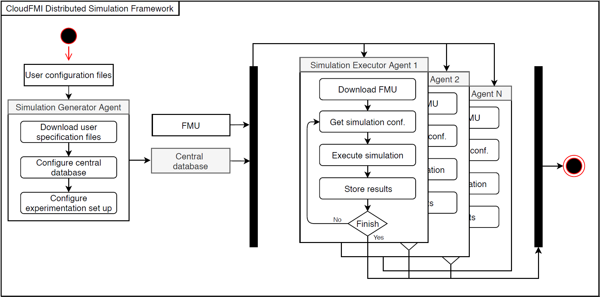

# CloudFMI Distributed Simulation Framework
This is a cloud-based Distributed Simulation (DS) framework build in Python that enables executing in parallel multiple configurations of a single FMI compliant model. This framework is composed of (i) a central database where all the information related to the experimentation is performed, (ii) a Simulation Generator Agent (SGA) that configures the experimentation set up based on the user specifications and automatically labels each simulation, and (iii) a Simulation Executor Agent (SEA) that executes the scheduled simulations. To parallelize the simulations, as many SEAs as required can be instantiated. In the following figure can be seen the general overview of the CloudFMI Distributed Simulation Framework.



## Repository structure
The structure of the repository is as follows:

 - **[Kubernetes_job](Kubernetes_job/)**: contains configuration files to launch both the SGA and the SEA in Kubernetes.
 - **[Scalability_test](Scalability_test/)**: contains the code to conduct automatically a scalability test.
 - **[Simulation_Executor_Agent](Simulation_Executor_Agent/)**: contain the code of the SEA.
 - **[Simulation_Generator_Agent](Simulation_Generator_Agent/)**: contain the code of the SGA.
 - **[images](images/)**: contains figures shown in rhe readme.

## Requirements
These are the requirements to develop the CloudFMI Distributed Simulation Framework:
 - Python 3.6
 - [PyFMI 2.4.0](https://pypi.org/project/PyFMI/)
 - psycopg2 2.7.5
 - sqlalchemy 1.2.1
 - pandas
 - numpy
 - urllib.request

Requiremenst to dockerize the SGA and the SEA:
 - Docker 18 or higher

# Tutorial to deploy and run the CloudFMI Distributed Simulation Framework in Amazon Web Services
This is a tutorial to deploy an run the **CloudFMI Distributed Simulation Framework** in Amazon Web Services (AWS). Next, the general steps are provided: 

  1. [Create and configure a Kubernetes cluster using Amazon Elastic Container Service for Kubernetes (Amazon EKS)](#create-a-kubertenes-cluster)
  2. [Create a PostgreSQL database using Amazon Relational Database Service (Amazon RDS)](#create-a-postgresql-database)
  3. [Create Docker containers for both SGA and SEA (optional)](#create-docker-container-for-both-sga-and-sea-optional)
  4. [Run the SGA](#run-the-sga)
  5. [Run the SEA](#run-the-sea)

### Create a Kubernetes Cluster
We will create a Kubernetes cluster using [Amazon EKS](https://aws.amazon.com/eks/?nc1=h_ls), which provides an easy way of creating a Kubernetes cluster hosted in the servers of AWS. To do so, we will first create the EKS cluster and then add computational resources to it. Follow below steps:


  - We will use the oficial documentation to create the Amazon EKS cluster: [link to oficial documentation](https://docs.aws.amazon.com/eks/latest/userguide/getting-started.html)
  - Notes:
    - Use default configurations for _Kubernetes Version_, _Role name_, _VPC_, _subnets_, and _security groups_.
    - We do recommend enabling the public access.
    - Select the closest region to your location (_nodeImageId_).
    - Be carefull at selecting the "_NodeInstanceType_". Check pricing at this [link](https://aws.amazon.com/ec2/pricing/on-demand/).
    - Recommended Amazon EKS workers configuration for a small experiment:
        - **NodeAutoScalingGroupMinSize**: 3
        - **NodeAutoScalingGroupDesiredCapacity**: 3
        - **NodeAutoScalingGroupMaxSize**: 3
        - **NodeInstanceType**: t2.medium
        - **NodeImageId**: eu-west-2 (Ireland)
        - **NodeVolumeSize**: 20
    - Amazon EKS workers configuration used in our experimentation:
        - **NodeAutoScalingGroupMinSize**: 5
        - **NodeAutoScalingGroupDesiredCapacity**: 5
        - **NodeAutoScalingGroupMaxSize**: 5
        - **NodeInstanceType**: m4.4xlarge
        - **NodeImageId**: eu-west-2 (Ireland)
        - **NodeVolumeSize**: 20
 - Install the [Kubernetes dashboard](https://docs.aws.amazon.com/eks/latest/userguide/dashboard-tutorial.html) to monitor visually the resources of the cluster (optional).
    - Not being able to access to the dashboard is a commom issue. Use the following to address it:
        ```
        ```


### Create a PostgreSQL database
We will create a PostgreSQL database using [Amazon RDS](https://aws.amazon.com/rds/?nc1=h_ls), which enables creating the database following a few simple steps. The database will be also hosted in AWS.

 - Follow the oficial documentation to create de database: [link to oficial documentation](https://docs.aws.amazon.com/AmazonRDS/latest/UserGuide/CHAP_GettingStarted.CreatingConnecting.PostgreSQL.html)
 - Next, we provide the configurations we used in our experimentation ([more configuration details](https://aws.amazon.com/rds/postgresql/features/?nc1=h_ls)):
    - Small database (little performance):
        - **DB Instance Class**: _db.t2.small_
        - **Storage Type**: _General purpose (SSD)_
        - **Allocated Storage**: _40 GB_
    - Large database (high performance):
        - **DB Instance Class**: _db.m4.xlarge_
        - **Storage Type**: _Provisioned IOPS_
        - **Allocated Storage**: _100 GB_
- Installing a database administrator tool is highly recommended to visualize and query data stored in the database. Recommended tools:
    - [DBeaver](https://dbeaver.io/)
    - [pgAdmin](https://www.pgadmin.org/)

### Create Docker container for both SGA and SEA (optional)
Omit this step if you did not modify the code. In contrast, you have to containerize the SGA and/or the SEA with Docker again in case you modified them. Note that the generated images will have to be uploaded to a registry accesible by your cluster. To do so, follow these steps:

 1. Install Docker if not installed yet ([official web page](https://docs.docker.com/install/)).
 2. Dockerize the SGA:
    2.1. Go to the SGA root directory:
    ```
    $ cd Simulation_Generator_Agent
    ```
    2.2 Dockerize the SGA: 
    ```
    $ sudo docker build -t simulation-generator-agent:latest .
    ```
    2.3 Tag the container. Introduce the url and port of your registry:
    ```
    $ sudo tag simulation-generator-agent:latest {url}:{port}/simulation-generator-agent:latest
    ```
    2.4 Push the image to an accessible registry for your cluster:
    ```
    $ sudo docker push {url}:{port}/simulation-generator-agent:latest
    ```
 3. Dockerize the SEA:
    ```
    $ cd Simulation_Executor_Agent
    $ sudo docker build -t simulation-executor-agent:latest .
    $ sudo tag simulation-executor-agent:latest {url}:{port}/simulation-executor-agent:latest
    $ sudo docker push {url}:{port}/simulation-executor-agent:latest
    ```
    
**Note**: Using the registry of AWS [Amazon ECR](https://aws.amazon.com/ecr/?nc1=h_ls) is the easiest way to upload your images to an accessible registry. 

### Run the SGA
To run the SGA in kubernetes, a [Job](https://kubernetes.io/docs/concepts/workloads/controllers/jobs-run-to-completion/) that executes the SGA docker image must be launched. Recall that job must be launched from the same computer in which you have configured the Kubernetes cluster. Use the following commands to launch the SGA job:

 - Download the yaml file from [here](Kubernetes_jobs/simulation_generator-agent-job.yaml).
 - Modify the configuration file as required. Important fields to be changed (use defaul values for this tutorial):
    - **image**: set the path to your docker SGA image.
    - **command**: set the corresponding path and file names.
    - **env**: set the corresponding database connection parameters.
- Launch the job using _kubectl_:
  ```
  kubectl apply -f <path-to-file/simulation_generator-agent-job.yaml>
  ```
 - Once executed, you can check the database with the database administrator tool.
 
You can also 

 - **Local**: this is the easiest way, particularly if you are experimenting with several experimenatations. Follow these steps to execute it:
    - Download the code of the SGA from the repository
    - Configure your experimenation set-up by changing values in _input_params_, _output_params_, and _anomalous_params_ (using default settings is recommended).
    - Run the SGA
    ```
    $ python Simulation_Execution_Agent.py --input_params
    ```
    
### Run the SEA
To run the SGA in kubernetes, a [Job](https://kubernetes.io/docs/concepts/workloads/controllers/jobs-run-to-completion/) that executes the SGA docker image must be launched. Recall that job must be launched from the same computer in which you have configured the Kubernetes cluster. Use the following commands to launch the SGA job:

 - Download the yaml file from [here](Kubernetes_jobs/simulation_executor-agent-job.yaml).
 - Modify the configuration file as required. Important fields to be changed (use defaul values for this tutorial):
    - **parallelism**: indicates the number of SEAs running in parallel.
    - **image**: set the path to your docker SEA image.
    - **command**: set the corresponding path to the model.
    - **resources/requests/cpu**: indicates how many cores uses each SEA (equal to limit).
    - **resources/requests/memory**: indicates how many memory uses each SEA (equal to limit).
    - **env**: set the corresponding database connection parameters, maximum number of failures per simulation and the timeout limit.
- Launch the job using _kubectl_:
  ```
  kubectl apply -f <path-to-file/simulation_executor-agent-job.yaml>
  ```
 - If you have already installed it, you can monitor the execution of the SEAs from the Kubernetes dashboard.
 - You can also check the work in progress using the database administrator tool.

## Compiling a FMU
It is worth to point out that to run a FMU model on a given computer, it must be compiled in the same operative system. As far as the CloudFMI Distributed Simulation Framework is a Linux-based software, the FMU must be also compiled in a Linux-based computer.

Here it is a tool to compile a Modelica model in Linux using Docker: [ModelicaInAction](https://github.com/Neuw84/ModelicaInAction)
